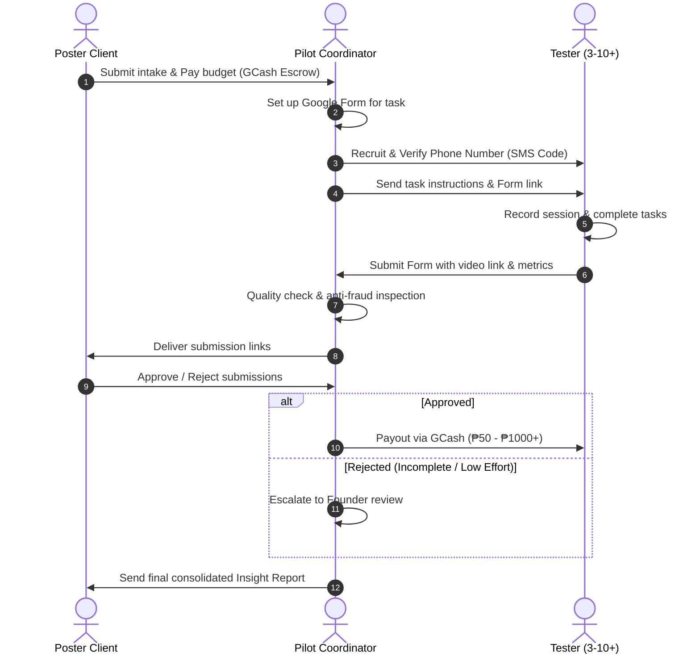

| version | 0.3 |
| name | manual_pilot_playbook |
| description | Operational playbook, templates, and spreadsheets for the manual validation pilot with scalable rates and participants. |

# Manual Pilot Playbook (Validation Step 2)

This document contains the end-to-end operational playbook, templates, and security guidelines for executing the manual pilot of **subukAn**. 

The goal of this manual pilot is to validate the core user testing proposition: matching **1 Poster Client** with a custom pool of **3 to 10+ Testers** (scalable depending on budget and chosen tier) to deliver valuable, qualitative, and structured feedback on a local Philippine web app using manual tools (Google Forms, Loom, Google Sheets, and manual GCash transfers) before any code is written.

---

## 1. Operational Workflow

The manual pilot replicates the core mechanics of the subukAn platform in a manual, founder-mediated manner. 

### Roles & Responsibilities
*   **Pilot Coordinator (Founder/Manager):** Acts as the platform, manual escrow agent, verifier, and communicator.
*   **Poster Client:** The web app developer/student needing feedback. Selects the rate tier, defines target slots, pays the budget upfront, provides the app link, and defines the tasks.
*   **Testers (3 to 10+ individuals):** Members of the PH tech community who execute the tasks, record their screen/audio, and submit feedback.



### Phase 1: Intake & Scoping (Day 1 - 2)
1.  **Client Selection:** Select one pilot client (e.g., a capstone student or solo developer with a deployed web app).
2.  **Task Definition:** Work with the client to define **3 core tasks** they want tested. Tasks must be action-oriented (e.g., "Sign up and create a profile," "Add an item to the cart and checkout").
3.  **Budget Setup:** Agree on the rate and participant scale. The poster selects a rate per tester from a discrete set of tiers: **₱50, ₱100, ₱200, ₱300, ₱400, ₱500, up to ₱1000, ₱1100, etc.** and chooses the number of target participants (ranging from **3 to 10+ testers**). The total escrow budget is calculated as:
    $$\text{Total Escrow Budget} = \text{Slots Target} \times \text{Rate per Tester}$$
    The poster pays the total budget directly to the Coordinator's GCash upfront to be held in escrow (e.g., ₱2,000 for 10 testers at ₱200/tester, or ₱5,000 for 10 testers at ₱500/tester). This mimics the platform **escrow mechanism**.
4.  **Review Window:** Define the poster's review window: **24 hours** from submission delivery (adjusted from the platform's 30m/1h rule to accommodate manual pilot scheduling).

### Phase 2: Setup & Recruitment (Day 3)
1.  **Form Creation:** Coordinator sets up a customized Google Form for the test (see Section 2).
2.  **Tester Sourcing:** Recruit the target number of testers (3 to 10+ testers) from local developer groups, capstone circles, or student channels (see Section 3).
3.  **Tester Screening & Phone Verification:** 
    *   Testers must complete a brief screening message verifying their device (Mobile/Desktop) and tech comfort level.
    *   **Manual Phone Verification:** The Coordinator sends a random 4-digit code via SMS to the tester's GCash mobile number. The tester must reply with the correct code to confirm ownership and identity before receiving the task link.

### Phase 3: Test Execution (Day 4)
1.  **Task Distribution:** Send verified testers the Google Form link and recording instructions.
2.  **Execution Window:** Testers are given a **2-hour window** from receipt to complete and submit the form to maintain momentum.
3.  **Tracking:** Coordinator logs the start and submission times in the tracking sheet (see Section 5).

### Phase 4: Verification & Poster Review (Day 5)
1.  **Quality Check:** Coordinator checks the submitted screen recordings:
    *   Is the link public/accessible?
    *   Is the audio audible?
    *   Did the tester actually attempt the tasks?
2.  **Delivery to Poster:** Send checked submission links to the poster for review.
3.  **Review & Decisions:** The poster has 24 hours to review each tester's submission individually:
    *   **Approve:** Release payment.
    *   **Reject:** Poster must provide a dropdown reason and 2–3 sentences of justification. The Coordinator will review the rejection (founder-review) to prevent exploitation.
    *   **Auto-Release:** If the poster does not review within 24 hours, the coordinator automatically approves the submission and pays the tester.

### Phase 5: Payouts & Debrief (Day 6)
1.  **GCash Payouts:** Coordinator pays approved testers their designated rate tier (e.g., ₱50, ₱100, ₱200, ₱300, ₱400, ₱500, up to ₱1000, ₱1100, etc.) each via GCash, recording screenshots of transaction receipts.
2.  **Unfilled Slots & Refunds:** If the listing expires with unfilled slots (e.g., only 8 of 10 slots filled), the remaining escrow budget (e.g., 2 slots * ₱200/tester = ₱400) is refunded to the poster (or retained/apportioned as per agreed pilot mechanics or platform rules).
3.  **Insight Notification:** Deliver the manual consolidated report to the poster, detailing metrics (average time-on-task, average satisfaction, completion rate) and all qualitative responses.
4.  **Debrief Interviews:** Conduct a 10-minute feedback call with the Poster and at least 2 Testers to document operational friction.

---

## 2. Google Forms Structural Blueprint

The Google Form is the primary interface for collecting tester data, instructions, metrics, and video links. Set up the form using the structure below.

### Google Forms Configuration Settings
*   **Settings > Responses > Collect email addresses:** Set to **Verified** (requires Google Sign-In to limit to 1 response per account and prevent spam/duplicates).
*   **Settings > Responses > Limit to 1 response:** Set to **ON** (prevents duplicate submissions from the same tester).
*   **Settings > Presentation > Show link to submit another response:** Set to **OFF**.

### Form Layout & Fields

#### Section 1: Pre-Test Agreement & Profile
*   **Instruction Text (Section Header Description):**
    > **subukAn User Testing - Pre-Test Agreement**
    > Thank you for participating in this user test! Before you begin, please read and agree to the terms below. You will be asked to perform 3 tasks on a web application, record your screen and voice, and submit your honest feedback. You will receive the specified tester reward rate (e.g., ₱50, ₱100, ₱200, ₱300, ₱400, ₱500, up to ₱1000+) via GCash upon approval of a valid submission.
*   **Field 1.1: Full Name**
    *   *Type:* Short answer
    *   *Validation:* Required
*   **Field 1.2: GCash Mobile Number**
    *   *Type:* Short answer
    *   *Validation:* Required. Regular expression check: `^09\d{9}$` (must be a valid 11-digit PH mobile number starting with 09).
*   **Field 1.3: Device Type used for this test**
    *   *Type:* Multiple choice (Required)
    *   *Options:*
        *   [ ] Desktop / Laptop (Windows/macOS/Linux)
        *   [ ] Mobile Phone / Tablet (Android/iOS)
*   **Field 1.4: Technical Comfort Level**
    *   *Type:* Multiple choice (Required)
    *   *Options:*
        *   [ ] Tech-comfort: Student Developer / Software Engineer
        *   [ ] Tech-comfort: Casual Tech User (uses social media, online shopping, mobile banking easily)
        *   [ ] Tech-comfort: Non-Technical User (rarely uses web apps, finds tech challenging)
*   **Field 1.5: Data Privacy & Confidentiality Agreement**
    *   *Type:* Checkboxes (Required)
    *   *Description:* Pursuant to the Philippine Data Privacy Act of 2012 (RA 10173), your profile and recording will only be shared with the app developer for usability improvement. You agree not to disclose, share, or screenshot any proprietary features of the app tested.
    *   *Options:*
        *   [ ] I agree to the terms, consent to the recording of my screen and voice, and pledge to keep the app details confidential.

#### Section 2: Instructions & Recording Setup
*   **Instruction Text (Section Header):**
    > **Step 2: Recording Setup & App Access**
    > Please open your screen recorder (e.g., Loom, native system recorder) now.
    > 1. Start recording your screen and ensure your microphone is ON. 
    > 2. Introduce yourself: state your device and comfort level (e.g., "Hi, I am using a desktop and consider myself a casual user").
    > 3. Click the link below to open the test application:
    >    **Test App URL:** `https://example-client-app.vercel.app` (Coordinator will replace this with actual client app link)
    > 4. Keep this Google Form tab open in the background. Return to it to log your metrics after completing each task. Do not stop the recording until all tasks are finished!

#### Section 3: Task Execution & Structured Metrics
*Copy this section configuration for each of the tasks (Task 1, Task 2, Task 3).*

*   **Instruction Text (Section Header):**
    > **Task 1: [Insert Task Name, e.g., Sign up and Create a Profile]**
    > *Instructions:* Navigate to the sign-up page. Create a new account using fake data. Verify that you have reached the user dashboard and fill out your profile details. Speak out loud as you do this—describe what you expect to see, what is confusing, or where you get stuck.
*   **Field 3.1: Task Completion**
    *   *Type:* Multiple choice (Required)
    *   *Label:* Did you successfully complete this task?
    *   *Options:*
        *   [ ] Yes
        *   [ ] No
*   **Field 3.2: Difficulty Rating**
    *   *Type:* Linear scale (1 to 5) (Required)
    *   *Label:* Rate how easy or difficult this task was:
    *   *Labels for scale:* 1: Very Easy | 5: Very Difficult
*   **Field 3.3: Task Time-on-Task (Timestamp)**
    *   *Type:* Short answer (Required)
    *   *Label:* What is the video timestamp (MM:SS) when you started and finished this task?
    *   *Placeholder/Example:* Start: 00:30, End: 02:45
*   **Field 3.4: Task Qualitative Feedback**
    *   *Type:* Paragraph (Required)
    *   *Label:* What was the most confusing or frustrating part of this task? (If none, write "None").

#### Section 4: Submission & Payout Link
*   **Instruction Text (Section Header):**
    > **Final Step: Submit Recording**
    > Please stop your recording now and save/upload it.
*   **Field 4.1: Screen Recording Shareable URL**
    *   *Type:* Short answer (Required)
    *   *Label:* Paste your Loom link or Google Drive shareable link here:
    *   *Validation:* Must be a URL.
    *   *Instruction:* Make sure Google Drive link sharing is set to "Anyone with the link can view".
*   **Field 4.2: General Feedback**
    *   *Type:* Paragraph (Required)
    *   *Label:* Any other feedback or general comments about the app overall?

---

## 3. Communication Templates

### A. Poster Client Templates

#### Template A.1: Invitation to Pilot (Email/Messenger)
**Subject:** Get your web app tested by real local users (subukAn manual pilot)

```
Hi [Poster Name],

I hope you're doing well! 

We are launching the manual pilot for subukAn, a user testing platform tailored for Filipino developers and capstone projects. Before we write the codebase, we're running a manual pilot to match 1 developer with a custom cohort of 3 to 10+ real testers to validate the feedback quality.

If you have a deployed web app (e.g., a school project, portfolio piece, or client site) that needs a usability sanity check, we’d love to have you as our pilot client.

Here's how it works:
1. You provide the app link and 3 key tasks you want users to attempt.
2. You select a reward rate per tester from our discrete tiers (₱50, ₱100, ₱200, ₱300, ₱400, ₱500, up to ₱1000+) and choose your participant scale (from 3 to 10+ testers).
3. You fund the total escrow budget (calculated as: Slots Target * Rate per Tester) directly to our GCash account, which we hold in escrow.
4. We source, screen, and phone-verify the testers matching your target comfort level.
5. Testers record their screen and voice while attempting your tasks, submitting the videos and structured metrics.
6. You review the videos, approve them, and we release the GCash payout to the testers. If a tester didn't follow instructions, you can reject their submission.

Would you be interested in getting your app tested this week? Let me know, and we can set up your intake.

Best,
[Founder Name]
subukAn Coordinator
```

#### Template A.2: Intake & Onboarding Confirmation (Email/Messenger)
```
Hi [Poster Name],

Awesome! Let's get your test set up. To proceed, please reply with the following details:
1. Link to your deployed web app:
2. Any test credentials needed (e.g., test logins, sandbox accounts):
3. Three (3) specific tasks you want testers to perform:
   - Task 1: (e.g., Register a new account and fill in profile)
   - Task 2: (e.g., Search for an item and add it to cart)
   - Task 3: (e.g., Navigate to checkout and choose mock payment method)
4. Your target device: [Desktop only / Mobile only / Both]
5. Target tester profile type: [Devs/Students, Casual Users, or Non-Technical]
6. Chosen Rate per Tester Tier: [Select one: ₱50, ₱100, ₱200, ₱300, ₱400, ₱500, or increments of ₱100 up to ₱1000+]
7. Target Slots (Participant Scale): [Select custom number, e.g., 3 to 10+ slots]

To calculate your total budget, please use the following formula:
Total Escrow Budget = Target Slots * Rate per Tester

Example setups:
- High-scale budget: 10 slots at ₱200/tester = ₱2,000
- Premium-rate budget: 5 slots at ₱500/tester = ₱2,500
- Starter budget: 3 slots at ₱100/tester = ₱300

Once you send these, please transfer the total budget of ₱[Total Escrow Budget] based on your chosen rate tier and target slots to my GCash account (0917-123-4567, Juan Dela Cruz) to fund the manual escrow. I will set up the Google Form and begin recruitment immediately.

Best,
[Founder Name]
```

#### Template A.3: Submission Delivery & Review Request (Email/Messenger)
```
Hi [Poster Name],

We have collected [Target Slots, e.g., 10] submissions for your user test! 

Please find the details below. You have 24 hours to review these submissions. Reply to this message indicating which submissions are Approved or Rejected.

Tester Submissions:
1. Tester #1 (Desktop, Casual User) - Video: [Loom URL 1]
   - Form Responses: [Google Sheet Row Link / Summary]
2. Tester #2 (Mobile, Non-Tech User) - Video: [Google Drive URL 2]
   - Form Responses: [Google Sheet Row Link / Summary]
3. Tester #3 (Desktop, Dev User) - Video: [Loom URL 3]
   - Form Responses: [Google Sheet Row Link / Summary]
...
[List of Tester #4 to Tester #N, up to 10 or more depending on selected slots]

For any rejection, please provide a reason from this list: [Didn't follow instructions, Answers don't match recording, Incomplete task, Low effort] along with a 2-3 sentence explanation.

*Note: Any submission not reviewed within 24 hours (by [Date/Time 24 hours from now]) will be automatically approved and the budget released to the tester.*

Best,
[Founder Name]
```

---

### B. Tester Templates

#### Template B.1: Recruitment Call-Out (Facebook Group / Discord Post)
```
📢 LOOKING FOR [Target Slots, e.g., 10] WEB APP TESTERS ([Rate Tier, e.g., ₱200] GCash Payout)

Hey folks! We're running a quick user test pilot for a local PH web app and need [Target Slots, e.g., 10] testers to try it out. 

Requirements:
- Must have a working desktop/laptop or smartphone.
- Must be willing to record your screen and voice (using Loom or native recorder) for about 10-15 minutes.
- Must speak your thoughts out loud in English or Taglish while testing.
- Must have a verified GCash account for payout.

If you're interested, reply below with your device type (Desktop or Mobile) and tech comfort level (e.g., "Desktop, Casual User"). We will PM selected testers to verify their phone numbers and send the task link!
```

#### Template B.2: Screening & Phone Verification (Direct Message)
```
Hi [Tester Name], 

Thanks for volunteering to test! To verify your profile and prevent fraud/Sybil accounts, we require phone verification.

Please send your GCash-registered mobile number. I will send a 4-digit code to that number via SMS. Once you receive it, reply with the code here.

After verification, I'll send you the test instructions and Google Form link.

Best,
[Founder Name]
subukAn Coordinator
```

#### Template B.3: Test Assignment Instructions (Direct Message)
```
Awesome, you're verified! Here are the instructions for your user test. 

Your Task Link: [Google Form Link, e.g., https://forms.gle/xyz123abc]

Please follow these steps carefully:
1. Open the form link above.
2. Follow the instructions in Section 1 to set up your screen and microphone recording (using Loom or your native system recorder).
3. Attempt the 3 tasks listed in the form. Remember to speak your thoughts out loud (e.g., "I'm looking for the register button... I see it here, but the text is a bit small").
4. Log your metrics (Yes/No completion, difficulty, and start/end time stamps) in the form as you complete each task.
5. Paste your video link in the final section and submit the form.

Please submit your response within the next 2 hours. Once the poster reviews your submission (usually within 24 hours), we will release the [Rate Tier, e.g., ₱200] payout to your GCash number.

Let me know if you run into any technical issues!
```

#### Template B.4: Payout Confirmation (Direct Message)
```
Hi [Tester Name],

Your submission has been reviewed and approved by the developer! They found your feedback highly valuable.

I have transferred your [Rate Tier, e.g., ₱200] payout to your GCash number. 
Transaction Ref: [GCash Reference ID, e.g., 1002 999 8888]

Could you share one thing that felt smooth or confusing about our testing process itself? We want to make the next version better.

Thanks again for your time!
```

---

## 4. Screen Recording & Media Submission Guide

To prevent technical friction during the pilot, testers must be given clear instructions on how to record and share their sessions.

### Desktop Testers (Windows, macOS, Linux)
The recommended tool is **Loom** (free account) because it automatically uploads the video and generates a shareable link instantly.
1.  **Loom Setup (Recommended):**
    *   Go to `https://www.loom.com` and sign up for a free account.
    *   Install the Loom Chrome Extension or desktop app.
    *   Set recording type to **Screen + Cam** or **Screen Only**. Ensure **Microphone** is active.
    *   Click **Start Recording**. Once finished, click **Stop**. Copy the shareable link.
2.  **Native Alternatives:**
    *   *Windows:* Press `Win + Alt + R` (Windows Game Bar). Access the video file in the `Videos/Captures` folder.
    *   *macOS:* Open QuickTime Player > File > New Screen Recording. Ensure microphone is selected.
    *   Upload the video file to **Google Drive**. Set sharing permissions to **"Anyone with the link can view"**.

### Mobile Testers (Android, iOS)
1.  **iOS Native Recorder (Apple):**
    *   Add "Screen Recording" to Control Center via Settings.
    *   Swipe down to open Control Center, long-press the screen record icon, and turn **Microphone ON**.
    *   Tap **Start Recording**. Save video to Photos.
2.  **Android Native Recorder:**
    *   Swipe down notifications to find **Screen Record** tile.
    *   Ensure **Media and Mic** audio source is selected.
    *   Tap **Start**. Save video to Gallery.
3.  **File Upload:**
    *   Upload the recorded video to Google Drive.
    *   **Crucial Step:** Long-press the file in Google Drive, select **Manage Access**, and change General Access from *Restricted* to **"Anyone with the link can view"** (Viewer role). Copy the link.

### Verification Steps for Coordinator
Before sending links to the poster:
*   Open the link in an **Incognito Window** to verify that it does not require a password or permission request.
*   Play 15 seconds of the video to ensure audio is working.

---

## 5. Manual Tracking Spreadsheet Layout

The Coordinator uses a Google Sheet to track the flow of money, listings, and tester details. Below is the blueprint of the sheets.

### Tab 1: Listings & Escrow
This tab tracks the pilot run budget and poster information.

| Column | Field Name | Description / Formula | Row 2 Example (Base Case) | Row 3 Example (High Scale) | Row 4 Example (Premium Tier) | Row 5 Example (High Scale & Premium) |
| :--- | :--- | :--- | :--- | :--- | :--- | :--- |
| A | **Listing ID** | Unique ID for the pilot listing | `LST-001` | `LST-002` | `LST-003` | `LST-004` |
| B | **Poster Name** | Client name | `Juan Cruz` | `Patricia Diaz` | `Alex Lim` | `Sarah G.` |
| C | **App URL** | Link to the app under test | `https://mycapstone.vercel.app` | `https://sarisaristore.ph` | `https://fintech-ph.com` | `https://learn-ph.edu` |
| D | **Slots Target** | Number of testers requested (3 to 10+) | `5` | `10` | `3` | `12` |
| E | **Rate per Tester** | Payout amount from discrete tiers | `100` | `200` | `1000` | `500` |
| F | **Total Escrow Budget**| Total budget funded: `=D[Row]*E[Row]` | `=D2*E2` (500) | `=D3*E3` (2000) | `=D4*E4` (3000) | `=D5*E5` (6000) |
| G | **Escrow Status** | Funded / Completed / Refunded | `Completed` | `Funded` | `Funded` | `Completed` |
| H | **GCash Reference In**| Transaction ID of poster payment | `90028172635` | `90028172636` | `90028172637` | `90028172638` |
| I | **Review Window** | Deadline duration | `24 Hours` | `24 Hours` | `24 Hours` | `24 Hours` |

### Tab 2: Tester Registry
Tracks the pool of screened testers.

| Column | Field Name | Description / Formula | Row 2 Example | Row 3 Example | Row 4 Example | Row 5 Example |
| :--- | :--- | :--- | :--- | :--- | :--- | :--- |
| A | **Tester ID** | Unique ID for the tester | `TST-001` | `TST-002` | `TST-003` | `TST-004` |
| B | **Tester Name** | Full name | `Maria Santos` | `Juan Dela Cruz` | `Elena Ramos` | `Mark Garcia` |
| C | **GCash Number** | 11-digit mobile number | `09181234567` | `09171112222` | `09203334444` | `09095556666` |
| D | **Device Type** | Desktop / Mobile | `Desktop` | `Mobile` | `Desktop` | `Mobile` |
| E | **Comfort Level** | Tech comfort tag | `Casual Tech User` | `Student Developer` | `Non-Technical User`| `Casual Tech User` |
| F | **Verification Status**| Verified / Pending / Rejected | `Verified` | `Verified` | `Verified` | `Verified` |
| G | **Verification Code**| Sent 4-digit SMS code | `7482` | `1829` | `9301` | `4859` |

### Tab 3: Submissions & Metrics
Tracks individual test results.

| Column | Field Name | Description / Formula | Row 2 Example | Row 3 Example | Row 4 Example |
| :--- | :--- | :--- | :--- | :--- | :--- |
| A | **Submission ID** | Unique ID for the submission | `SUB-001` | `SUB-002` | `SUB-003` |
| B | **Listing ID** | Foreign key linking to Tab 1 | `LST-002` | `LST-003` | `LST-001` |
| C | **Tester ID** | Foreign key linking to Tab 2 | `TST-001` | `TST-002` | `TST-003` |
| D | **Video URL** | Loom or Drive video link | `https://loom.com/share/xyz` | `https://drive.google.com/...`| `https://loom.com/share/abc` |
| E | **Task 1 Status** | Complete / Incomplete | `Complete` | `Complete` | `Complete` |
| F | **Task 1 Duration (sec)**| Time spent in seconds | `135` | `120` | `180` |
| G | **Task 1 Rating** | 1-5 Difficulty score | `2` | `3` | `1` |
| H | **Task 2 Status** | Complete / Incomplete | `Complete` | `Complete` | `Complete` |
| I | **Task 2 Duration (sec)**| Time spent in seconds | `105` | `150` | `90` |
| J | **Task 2 Rating** | 1-5 Difficulty score | `1` | `2` | `2` |
| K | **Task 3 Status** | Complete / Incomplete | `Complete` | `Incomplete` | `Complete` |
| L | **Task 3 Duration (sec)**| Time spent in seconds | `180` | `240` | `150` |
| M | **Task 3 Rating** | 1-5 Difficulty score | `4` | `5` | `1` |
| N | **Total Duration (sec)**| Sum of durations: `=SUM(F[Row], I[Row], L[Row])` | `=SUM(F2, I2, L2)` (420)| `=SUM(F3, I3, L3)` (510)| `=SUM(F4, I4, L4)` (420)|
| O | **Average Difficulty**| Average difficulty: `=AVERAGE(G[Row], J[Row], M[Row])` | `=AVERAGE(G2, J2, M2)` (2.33)| `=AVERAGE(G3, J3, M3)` (3.33)| `=AVERAGE(G4, J4, M4)` (1.33)|
| P | **Status** | Pending / Approved / Rejected | `Approved` | `Approved` | `Approved` |
| Q | **Review Reason** | Rejection dropdown choice / N/A | `N/A` | `N/A` | `N/A` |
| R | **Review Details** | Poster feedback explanation | `User navigated fine but found checkout slow.`| `Struggled with checkout task before failing.` | `Very helpful. Quick walkthrough.` |

### Tab 4: Ledger & Payouts
Tracks payments made out of manual escrow.

| Column | Field Name | Description / Formula | Row 2 Example | Row 3 Example | Row 4 Example |
| :--- | :--- | :--- | :--- | :--- | :--- |
| A | **Txn ID** | Unique transaction reference | `TXN-001` | `TXN-002` | `TXN-003` |
| B | **Submission ID** | Links to Tab 3 | `SUB-001` | `SUB-002` | `SUB-003` |
| C | **Recipient GCash** | Look up GCash number:<br>`=VLOOKUP(VLOOKUP(B[Row], Submissions!$A:$C, 3, FALSE), Testers!$A:$C, 3, FALSE)` | `=VLOOKUP(VLOOKUP(B2, Submissions!$A:$C, 3, FALSE), Testers!$A:$C, 3, FALSE)` (09181234567) | `=VLOOKUP(VLOOKUP(B3, Submissions!$A:$C, 3, FALSE), Testers!$A:$C, 3, FALSE)` (09171112222) | `=VLOOKUP(VLOOKUP(B4, Submissions!$A:$C, 3, FALSE), Testers!$A:$C, 3, FALSE)` (09203334444) |
| D | **Amount Paid** | Look up Rate per Tester:<br>`=VLOOKUP(VLOOKUP(B[Row], Submissions!$A:$B, 2, FALSE), Listings!$A:$E, 5, FALSE)` | `=VLOOKUP(VLOOKUP(B2, Submissions!$A:$B, 2, FALSE), Listings!$A:$E, 5, FALSE)` (200) | `=VLOOKUP(VLOOKUP(B3, Submissions!$A:$B, 2, FALSE), Listings!$A:$E, 5, FALSE)` (1000) | `=VLOOKUP(VLOOKUP(B4, Submissions!$A:$B, 2, FALSE), Listings!$A:$E, 5, FALSE)` (100) |
| E | **Payout Date** | Timestamp of transfer | `2026-07-28` | `2026-07-29` | `2026-07-30` |
| F | **GCash Reference Out**| GCash confirmation reference | `20019283746` | `20019283747` | `20019283748` |

---

## 6. GCash Payout & Security Protocols (Anti-Fraud)

Because this model moves real money manually, it is vulnerable to **Sybil/self-dealing attacks** (where one person poses as both poster and multiple testers). The following protocols must be strictly enforced.

### Pre-Payout Verification Checklist
Before sending any GCash payout to a tester, the Coordinator must run the following check:

```
[ ] Video Check: Video has audio, the user spoke out loud, and the user walked through all 3 tasks on the designated web app.
[ ] Email Match: The Google account that submitted the form matches the email address provided in communications.
[ ] GCash Number Verification: The recipient GCash number has been verified via SMS.
[ ] Review Status: The poster has explicitly approved the submission OR the 24-hour auto-release window has expired.
```

### Sybil & Self-Dealing Detection
Run these checks to flag potential fraud before releasing funds:
1.  **IP Address / Submission Metadata check:** 
    *   Use the "Show details" option in Google Sheet form responses to check submission timestamps. Submissions made within minutes of each other or in rapid succession should be flagged for inspection.
2.  **Cross-Reference Names & Numbers:**
    *   Compare the Poster's GCash name/number with all Tester GCash names/numbers in the tracker. If a tester GCash number matches the poster GCash number or shares the same surname/location details, flag it as a self-dealing attempt.
3.  **Video Metadata & Audio Identity Verification:**
    *   Listen to the voice recordings of the testers. If the voice, background environment, or screen profile (e.g., username, screen resolution, browser configuration) is identical across different tester submissions, suspend the payouts.
4.  **Device Fingerprint manual proxy:**
    *   Check if multiple testers are using the exact same operating system, browser version, and recording resolution. While some overlap is natural, identical patterns with similar qualitative writing styles suggest one person executing multiple slots.

### Payout Execution Flow
1.  Verify the submission status is `Approved` in the spreadsheet.
2.  Open GCash and navigate to **Send Money > Express Send**.
3.  Carefully enter the Tester's verified GCash number from **Tab 2: Column C**.
4.  Enter the payout amount matching the specific rate tier selected for that listing (e.g., ₱50, ₱100, ₱200, ₱300, ₱400, ₱500, up to ₱1000, ₱1100, etc.) as recorded in **Tab 4: Column D**.
5.  Double-check the Recipient Name displayed by GCash against the registered name in the **Tester Registry (Tab 2: Column B)**.
6.  Execute transaction, take a screenshot of the receipt, and log the 11-digit **GCash Reference Out** in **Tab 4: Column F**.

### Handling Disputed Rejections
If a Poster rejects a submission:
1.  **Founder Review Trigger:** The Coordinator holds the funds in escrow and reviews the video.
2.  **Validation of Rejection:**
    *   *Valid Rejection:* The tester did not speak, skipped tasks, or entered gibberish in the form. Action: Inform the tester of the reason and forfeit the payout. The slot remains open (or funds are returned/forfeited based on listing status).
    *   *Invalid Rejection (Low Quality Poster Behavior):* The tester did their best and followed instructions, but the poster was unsatisfied with the actual app feedback (e.g., "They said my app UI is ugly, I don't want to pay them"). Action: Overrule the rejection, pay the tester from escrow, and flag the poster for low-quality marketplace behavior.
